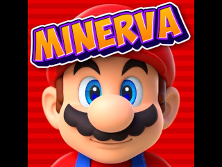

<a id="readme-top"></a>


<!-- PROJECT SHIELDS -->
[![Contributors][contributors-shield]][contributors-url]
[![Forks][forks-shield]][forks-url]
[![Stargazers][stars-shield]][stars-url]
[![Issues][issues-shield]][issues-url]
[![GPL-3.0 License][license-shield]][license-url]


<!-- PROJECT LOGO -->
<br />
<div align="center">
  <a href="https://github.com/24high/Minerva-Emulator-Console">
    
  </a>

  <h3 align="center">Minerva Console</h3>

  <p align="center">
    A bare-metal retro console for the Retroflag GPi Case (Raspberry Pi Zero), the GPi Case 2 (Compute Module 4) and the Raspberry Pi 5.
    <br />
    It boots into the game list in about 5 seconds, instead of the usual 30 to 45 seconds.
    <br />
    <a href="baremetal/README.md"><strong>Explore the docs »</strong></a>
    <br />
    <br />
    Ready-made SD card files: <a href="output-gpi">GPi Case</a> &middot; <a href="output-gpi2">GPi Case 2</a> &middot; <a href="output-rpi5">Raspberry Pi 5</a>
    &middot;
    <a href="https://github.com/24high/Minerva-Emulator-Console/issues/new?labels=bug">Report Bug</a>
    &middot;
    <a href="https://github.com/24high/Minerva-Emulator-Console/issues/new?labels=enhancement">Request Feature</a>
  </p>
</div>


<!-- TABLE OF CONTENTS -->
<details>
  <summary>Table of Contents</summary>
  <ol>
    <li>
      <a href="#about-the-project">About The Project</a>
      <ul>
        <li><a href="#supported-hardware">Supported Hardware</a></li>
        <li><a href="#supported-systems">Supported Systems</a></li>
        <li><a href="#built-with">Built With</a></li>
      </ul>
    </li>
    <li>
      <a href="#getting-started">Getting Started</a>
      <ul>
        <li><a href="#prerequisites">Prerequisites</a></li>
        <li><a href="#installation">Installation</a></li>
      </ul>
    </li>
    <li><a href="#usage">Usage</a></li>
    <li><a href="#roadmap">Roadmap</a></li>
    <li><a href="#contributing">Contributing</a></li>
    <li><a href="#license">License</a></li>
    <li><a href="#contact">Contact</a></li>
    <li><a href="#acknowledgments">Acknowledgments</a></li>
  </ol>
</details>


<!-- ABOUT THE PROJECT -->
## About The Project

Minerva Console runs libretro emulator cores directly on the hardware of a Raspberry Pi, without Linux or any other operating system underneath. It is built on the Circle bare-metal C++ environment. You switch it on and about 5 seconds later you are in the game list. A Linux based setup on the same hardware usually needs 30 to 45 seconds to get there.

Minerva Console exists for three devices:
* **Retroflag GPi Case** with a Raspberry Pi Zero / Zero W
* **Retroflag GPi Case 2** with a Raspberry Pi Compute Module 4
* **Raspberry Pi 5** on a TV, with a USB gamepad

All three show the same game list and run the same emulators; the GPi Case 2 and the Pi 5 also play N64 games.

Why bare metal:
* Boots in about 5 seconds instead of 30 to 45
* Nothing to update or break in the background
* The whole system is one kernel file on a FAT32 SD card
* Turning the case off is safe at any time, saves are written before the power is cut

The GPi Case and the GPi Case 2 normally need a set of overlays and scripts on Linux for their screen, sound, controller and safe shutdown. Here the kernel handles all of that itself: on the GPi Case the DPI display, PWM audio on GPIO18/19, the built-in controller (it shows up as an Xbox 360 pad) and the power switch; on the GPi Case 2 the 640x480 DPI display, the case's USB sound card, the controller and the power switch.

### Supported Hardware

| Device | Kernel | SD card files | Image |
|---|---|---|---|
| Retroflag GPi Case with a Raspberry Pi Zero / Zero W | 32-bit, 15 cores | [`output-gpi`](output-gpi) | `dist/minerva-gpi-zero.img` |
| Retroflag GPi Case 2 with a Compute Module 4 | 64-bit, 16 cores (with N64) | [`output-gpi2`](output-gpi2) | `dist/minerva-gpi2-cm4.img` |
| Raspberry Pi 5 on a TV (HDMI, USB gamepad) | 64-bit, 16 cores (with N64) | [`output-rpi5`](output-rpi5) | `dist/minerva-rpi5.img` |

The GPi Case 2 kernel drives the case the same way: the 640x480 DPI screen, its USB sound card, the controller and the power switch. It is built for a CM4 Lite, which boots from the SD card. The dock (HDMI output) is not supported yet.

The GPi Case is tested on the device. The Pi 5 and GPi Case 2 kernels pass the same emulated tests (all cores on a Cortex-A76 and a Cortex-A72 under QEMU), but have not run on real hardware yet.

The project started as a bare-metal port of RetroArch for the Raspberry Pi 5; the Pi 5 version now has the same game list and cores as the GPi versions. The original Windows UWP port this repository is based on is described in [README-UWP.md](README-UWP.md).

<p align="right">(<a href="#readme-top">back to top</a>)</p>


### Supported Systems

| System | Core | File extensions |
|---|---|---|
| Nintendo Entertainment System | FCEUmm | `.nes` |
| Game Boy / Game Boy Color | Gambatte | `.gb` `.dmg` `.gbc` |
| Game Boy Advance | gpSP (with ARM dynarec) | `.gba` `.agb` |
| Super Nintendo | Snes9x 2002 | `.sfc` `.smc` `.swc` `.fig` |
| Mega Drive / Genesis, 32X | PicoDrive | `.md` `.gen` `.smd` `.bin` `.32x` |
| Master System, Game Gear, SG-1000 | PicoDrive | `.sms` `.gg` `.sg` |
| Atari 2600 | Stella 2014 | `.a26` |
| Atari Lynx | Handy | `.lnx` |
| PC Engine / TurboGrafx-16 | Beetle PCE Fast | `.pce` |
| WonderSwan / WonderSwan Color | Beetle WonderSwan | `.ws` `.wsc` |
| ZX Spectrum | Fuse | `.tzx` `.tap` `.z80` `.sna` `.szx` |
| Sinclair ZX81 | EightyOne | `.p` `.t81` |
| Amstrad CPC | Caprice32 | `.dsk` `.cdt` |
| Commodore 64 | Frodo | `.d64` `.t64` `.x64` `.p00` |
| PICO-8 | fake-08 | `.p8` `.p8.png` |
| Arcade | MAME 2000 (0.37b5) | `.zip` |
| Nintendo 64 (GPi Case 2 and Pi 5 only) | Mupen64Plus-Next | `.z64` `.n64` `.v64` |

All cores are linked into a single kernel, the right one is picked by the file extension. None of them needs a BIOS file. The PC Engine core plays HuCards only, CD games are not supported. N64 needs a 64-bit Pi; leaving an N64 game restarts the console (about 5 seconds) instead of returning to the game list directly.

MS-DOS, the PSP and the N-Gage are not included. The PSP and the N-Gage are far beyond what a Pi Zero can emulate, and on the 64-bit boards their emulators would need the GPU through OpenGL or Vulkan, which a bare-metal kernel does not have. The DOS emulators either need threads or a set of libraries that do not exist without an operating system.

<p align="right">(<a href="#readme-top">back to top</a>)</p>


### Built With

* [![Circle][Circle-badge]][Circle-url]
* [![libretro][libretro-badge]][libretro-url]
* [![C++][Cpp-badge]][Cpp-url]
* [![Raspberry Pi][RaspberryPi-badge]][RaspberryPi-url]
* [![Node.js][Node-badge]][Node-url]

<p align="right">(<a href="#readme-top">back to top</a>)</p>


<!-- GETTING STARTED -->
## Getting Started

If you only want to play, copy the contents of [`output-gpi`](output-gpi) (GPi Case), [`output-gpi2`](output-gpi2) (GPi Case 2) or [`output-rpi5`](output-rpi5) (Raspberry Pi 5) to a FAT32-formatted SD card, add your games and put the card in. Nothing has to be built for that.

To build the kernel yourself, follow the steps below.

### Prerequisites

* A Linux PC
* Node.js 18 or newer
* Arm GNU Toolchain 15.2.rel1 from [developer.arm.com](https://developer.arm.com/downloads/-/arm-gnu-toolchain-downloads), unpacked into `./toolchain`: `arm-none-eabi` for the GPi Case, `aarch64-none-elf` for the GPi Case 2 and the Pi 5
* For the SD card image: dosfstools and mtools
  ```sh
  sudo apt install dosfstools mtools
  ```

### Installation

1. Clone the repo
   ```sh
   git clone https://github.com/24high/Minerva-Emulator-Console.git
   cd Minerva-Emulator-Console
   ```
2. Get Circle
   ```sh
   git clone --depth 1 https://github.com/rsta2/circle.git circle
   ```
3. Get the cores
   ```sh
   git clone --depth 1 https://github.com/libretro/libretro-fceumm.git baremetal/cores/libretro-fceumm
   git clone --depth 1 https://github.com/libretro/gambatte-libretro.git baremetal/cores/gambatte-libretro
   git clone --depth 1 https://github.com/libretro/snes9x2002.git baremetal/cores/snes9x2002
   git clone --depth 1 --recurse-submodules --shallow-submodules https://github.com/libretro/picodrive.git baremetal/cores/picodrive
   git clone --depth 1 https://github.com/libretro/gpsp.git baremetal/cores/gpsp
   git clone --depth 1 https://github.com/libretro/stella2014-libretro.git baremetal/cores/stella2014-libretro
   git clone --depth 1 https://github.com/libretro/libretro-handy.git baremetal/cores/libretro-handy
   git clone --depth 1 https://github.com/libretro/beetle-pce-fast-libretro.git baremetal/cores/beetle-pce-fast-libretro
   git clone --depth 1 https://github.com/libretro/beetle-wswan-libretro.git baremetal/cores/beetle-wswan-libretro
   git clone --depth 1 https://github.com/libretro/fuse-libretro.git baremetal/cores/fuse-libretro
   git clone --depth 1 https://github.com/libretro/81-libretro.git baremetal/cores/81-libretro
   git clone --depth 1 https://github.com/libretro/libretro-cap32.git baremetal/cores/libretro-cap32
   git clone --depth 1 https://github.com/libretro/frodo-libretro.git baremetal/cores/frodo-libretro
   git clone --depth 1 --recurse-submodules --shallow-submodules https://github.com/jtothebell/fake-08.git baremetal/cores/fake-08
   git clone --depth 1 https://github.com/libretro/mame2000-libretro.git baremetal/cores/mame2000-libretro
   git clone --depth 1 https://github.com/libretro/mupen64plus-libretro-nx.git baremetal/cores/mupen64plus-libretro-nx
   ```
   The last one (N64) is only needed for the GPi Case 2 and the Pi 5.
   The build applies the small fixes in `baremetal/patches` to the cores by itself.
4. Build the kernel and the SD card image
   ```sh
   npm run build:gpi     # GPi Case (Pi Zero)
   npm run build:gpi2    # GPi Case 2 (CM4)
   npm run build:rpi5    # Raspberry Pi 5
   ```
   The image is 256 MB by default; `SD_IMAGE_MB=4096 npm run build:gpi` makes it 4 GB.
5. Flash the image from `dist/` with Raspberry Pi Imager or `dd`, or copy the contents of `output-gpi/`, `output-gpi2/` or `output-rpi5/` to a FAT32 SD card. The build downloads the Raspberry Pi firmware files it needs.

<p align="right">(<a href="#readme-top">back to top</a>)</p>


<!-- USAGE EXAMPLES -->
## Usage

Copy your games anywhere onto the SD card, folders and long file names are fine. Set the SAFE SHUTDOWN switch of the GPi Case to ON. The GPi Case 2 uses the same buttons as the GPi Case; on the Pi 5 connect a USB gamepad (Xbox 360 style pads work best).

**Game list**

| Button | Action |
|---|---|
| D-pad left / right | Previous / next tile |
| D-pad up / down | Row up / down |
| A | Start game or open folder |
| B | Back to the parent folder |

Every game is shown as a square tile with its name below. Games without their own picture show the logo of their system. Only games and folders are listed (up to 512 per folder); pictures, saves and other files stay hidden.

**Game pictures**

To give a game its own picture on the tile:

1. Find a picture of the game, for example the box art or the title screen. Square pictures fill the whole tile, other shapes are fitted in with bars on two sides.
2. Save it as a PNG file. JPEG and other formats are not supported. Any size up to 2048 x 2048 pixels works; around 256 x 256 is plenty for the GPi screen and loads fastest.
3. Name it exactly like the game file, but with `.png` instead of the game's extension, and copy it into the same folder as the game:
   ```
   GBA/
     Pokemon - FireRed Version (USA).gba
     Pokemon - FireRed Version (USA).png
   ```
   Adding `.png` to the full file name works as well, for example `Pokemon - FireRed Version (USA).gba.png`.
4. Put the SD card back into the case. The picture shows up the next time the folder is opened.

If your games use the usual No-Intro names, the box art from [libretro-thumbnails](https://github.com/libretro-thumbnails) (folder `Named_Boxarts`) already has matching names. In those file names the characters `` &*/:`<>?\|" `` are replaced by `_`, so rename the picture if the game name contains one of them.

A picture that cannot be read (damaged file, larger than 4 MB or 2048 x 2048 pixels) is skipped and the system logo is shown instead.

**In game**

| Button | Action |
|---|---|
| Start + Select (hold for half a second) | Back to the game list |
| Power switch off | Saves, then turns the case off |

The GPi Case only has A, B, X and Y, so systems with shoulder buttons get them on Y (L) and X (R). The same layouts are used on the GPi Case 2 and the Pi 5:

| System | Layout |
|---|---|
| NES, Game Boy, Master System, Game Gear | A and B as labelled |
| Game Boy Advance | A, B, Y = L, X = R |
| Super Nintendo | A, B, X, Y as labelled, Select + Y = L, Select + X = R |
| Mega Drive (6-button pad) | Y = A, B = B, A = C, X = Y, Select + Y = X, Select + X = Z |
| Atari 2600 | B = fire, Select = game select, Start = reset, Select + Y / X = left / right difficulty |
| Atari Lynx | A, B, Y = Option 1, X = Option 2, Start = pause |
| PICO-8 | B = O, A = X, Start = pause |
| Arcade (MAME) | B, A, Y, X = buttons 1 to 4, Select + Y / X = buttons 5 and 6, Select = coin, Start = start |
| ZX Spectrum | D-pad = joystick (Kempston and cursor keys 5 to 8 at the same time), A, X, Y = fire (also key 0), B = up, Select = on-screen keyboard |
| ZX81 | D-pad = keys 5 to 8, A, B, X, Y = key 0, Select = on-screen keyboard |
| Amstrad CPC | D-pad = joystick, A = fire, B = second fire button, Y = space, Select + Start (short) = on-screen keyboard, Select + B types `CAT`, Select + A types `RUN"DISC` |
| C64 | D-pad and A = joystick, Y = on-screen keyboard, Select switches between joystick and mouse |

On the Super Nintendo, the Mega Drive, the Atari 2600 and in MAME a short press of Select still reaches the game.

**Arcade games** need ROM sets that match MAME 0.37b5 (the version MAME 2000 is based on). Keep each set zipped under its MAME name, for example `pacman.zip`.

Many Spectrum and CPC games use the keyboard until you pick the joystick in their menu. Use the on-screen keyboard for that. On the CPC it has a pointer: move it with the D-pad, press a key with A, close the keyboard with Select + Start. For example, *The Living Daylights* needs `f3` on the keypad for the joystick.

**ZX81 programs** that were saved without autostart start by themselves after loading. On the real machine they stop with `0/0` on an empty screen and wait for `RUN`.

**PICO-8 carts** can be text carts (`.p8`) or picture carts (`.p8.png`). A picture cart shows its own label on the tile.

**Saves**

In-game saves work on every system. They are stored next to the game as `<game name>.srm` (Game Boy cartridges with a clock also get a `.rtc` file), the same format RetroArch uses. A save is written about a second after you save in the game, and again when you leave the game or turn the case off.

**Core options**

Options go into `minerva.cfg` in the root of the SD card, in RetroArch's format:
```
gambatte_gb_internal_palette = "GB - Light"
picodrive_input1 = "3 button pad"
```

For more details, like the build options, the tests and how the cores are linked, please refer to the [documentation](baremetal/README.md) (German).

<p align="right">(<a href="#readme-top">back to top</a>)</p>


<!-- ROADMAP -->
## Roadmap

- [x] Raspberry Pi Zero / GPi Case port
- [x] NES, Game Boy, GBA, SNES, Mega Drive, Master System, Game Gear
- [x] In-game saves and clock for RTC cartridges
- [x] Return to the game list with Start + Select
- [x] Atari 2600, Lynx, PC Engine, WonderSwan, ZX Spectrum, ZX81, Amstrad CPC, C64, PICO-8 and arcade games
- [x] GPi Case 2 (CM4) and Raspberry Pi 5 with all cores plus N64
- [ ] GPi Case 2 dock (HDMI output)
- [ ] Testing on a real GPi Case 2 and Pi 5
- [ ] Save states
- [ ] Faster ARM cores for the Mega Drive (Cyclone, DrZ80)
- [ ] In-game menu (volume, reset)
- [ ] Mega-CD

See the [open issues](https://github.com/24high/Minerva-Emulator-Console/issues) for a full list of proposed features (and known issues).

<p align="right">(<a href="#readme-top">back to top</a>)</p>


<!-- CONTRIBUTING -->
## Contributing

If you have a fix or an idea, please fork the repo and create a pull request. You can also simply open an issue with the tag "enhancement".

1. Fork the Project
2. Create your Feature Branch (`git checkout -b feature/AmazingFeature`)
3. Commit your Changes (`git commit -m 'Add some AmazingFeature'`)
4. Push to the Branch (`git push origin feature/AmazingFeature`)
5. Open a Pull Request

Before a pull request, please run the tests in `baremetal/tests` (they run the cores on an emulated ARM1176 with qemu-arm, and with `--board=pi5` or `--board=gpi2` on an emulated Cortex-A76/A72 with qemu-aarch64).

<p align="right">(<a href="#readme-top">back to top</a>)</p>


<!-- LICENSE -->
## License

Distributed under the GNU General Public License v3.0. See `LICENSE` for more information.

The emulator cores keep their own licenses. Snes9x 2002, PicoDrive, Caprice32 and MAME 2000 may not be used commercially, so the same applies to the kernel images that include them.

<p align="right">(<a href="#readme-top">back to top</a>)</p>


<!-- CONTACT -->
## Contact

Dennis Michael Heine

Project Link: [https://github.com/24high/Minerva-Emulator-Console](https://github.com/24high/Minerva-Emulator-Console)

<p align="right">(<a href="#readme-top">back to top</a>)</p>


<!-- ACKNOWLEDGMENTS -->
## Acknowledgments

* [Circle](https://github.com/rsta2/circle) by Rene Stange
* [RetroArch and libretro](https://www.libretro.com)
* [FCEUmm](https://github.com/libretro/libretro-fceumm), [Gambatte](https://github.com/libretro/gambatte-libretro), [Snes9x 2002](https://github.com/libretro/snes9x2002), [PicoDrive](https://github.com/libretro/picodrive) and [gpSP](https://github.com/libretro/gpsp)
* [Mupen64Plus-Next](https://github.com/libretro/mupen64plus-libretro-nx)
* [Stella 2014](https://github.com/libretro/stella2014-libretro), [Handy](https://github.com/libretro/libretro-handy), [Beetle PCE Fast](https://github.com/libretro/beetle-pce-fast-libretro), [Beetle WonderSwan](https://github.com/libretro/beetle-wswan-libretro), [Fuse](https://github.com/libretro/fuse-libretro), [EightyOne](https://github.com/libretro/81-libretro), [Caprice32](https://github.com/libretro/libretro-cap32), [Frodo](https://github.com/libretro/frodo-libretro), [fake-08](https://github.com/jtothebell/fake-08) and [MAME 2000](https://github.com/libretro/mame2000-libretro)
* [Retroflag](https://retroflag.com) for the GPi Case and the GPi Case 2
* [stb_image](https://github.com/nothings/stb) by Sean Barrett, used to load the tile pictures
* The system logos on the tiles are taken from [wowroms.com](https://wowroms.com/en/all-roms)
* Bashar Astifan and [Gustave Monce](https://github.com/gus33000) for the UWP port this repository started from
* [Best-README-Template](https://github.com/othneildrew/Best-README-Template)
* [Img Shields](https://shields.io)

<p align="right">(<a href="#readme-top">back to top</a>)</p>


<!-- MARKDOWN LINKS & IMAGES -->
<!-- https://www.markdownguide.org/basic-syntax/#reference-style-links -->
[contributors-shield]: https://img.shields.io/github/contributors/24high/Minerva-Emulator-Console.svg?style=for-the-badge
[contributors-url]: https://github.com/24high/Minerva-Emulator-Console/graphs/contributors
[forks-shield]: https://img.shields.io/github/forks/24high/Minerva-Emulator-Console.svg?style=for-the-badge
[forks-url]: https://github.com/24high/Minerva-Emulator-Console/network/members
[stars-shield]: https://img.shields.io/github/stars/24high/Minerva-Emulator-Console.svg?style=for-the-badge
[stars-url]: https://github.com/24high/Minerva-Emulator-Console/stargazers
[issues-shield]: https://img.shields.io/github/issues/24high/Minerva-Emulator-Console.svg?style=for-the-badge
[issues-url]: https://github.com/24high/Minerva-Emulator-Console/issues
[license-shield]: https://img.shields.io/github/license/24high/Minerva-Emulator-Console.svg?style=for-the-badge
[license-url]: https://github.com/24high/Minerva-Emulator-Console/blob/main/LICENSE
[Circle-badge]: https://img.shields.io/badge/Circle-1B1B1B?style=for-the-badge
[Circle-url]: https://github.com/rsta2/circle
[libretro-badge]: https://img.shields.io/badge/libretro-000000?style=for-the-badge&logo=retroarch&logoColor=white
[libretro-url]: https://www.libretro.com
[Cpp-badge]: https://img.shields.io/badge/C++-00599C?style=for-the-badge&logo=cplusplus&logoColor=white
[Cpp-url]: https://isocpp.org
[RaspberryPi-badge]: https://img.shields.io/badge/Raspberry%20Pi-A22846?style=for-the-badge&logo=raspberrypi&logoColor=white
[RaspberryPi-url]: https://www.raspberrypi.com
[Node-badge]: https://img.shields.io/badge/Node.js-339933?style=for-the-badge&logo=nodedotjs&logoColor=white
[Node-url]: https://nodejs.org
